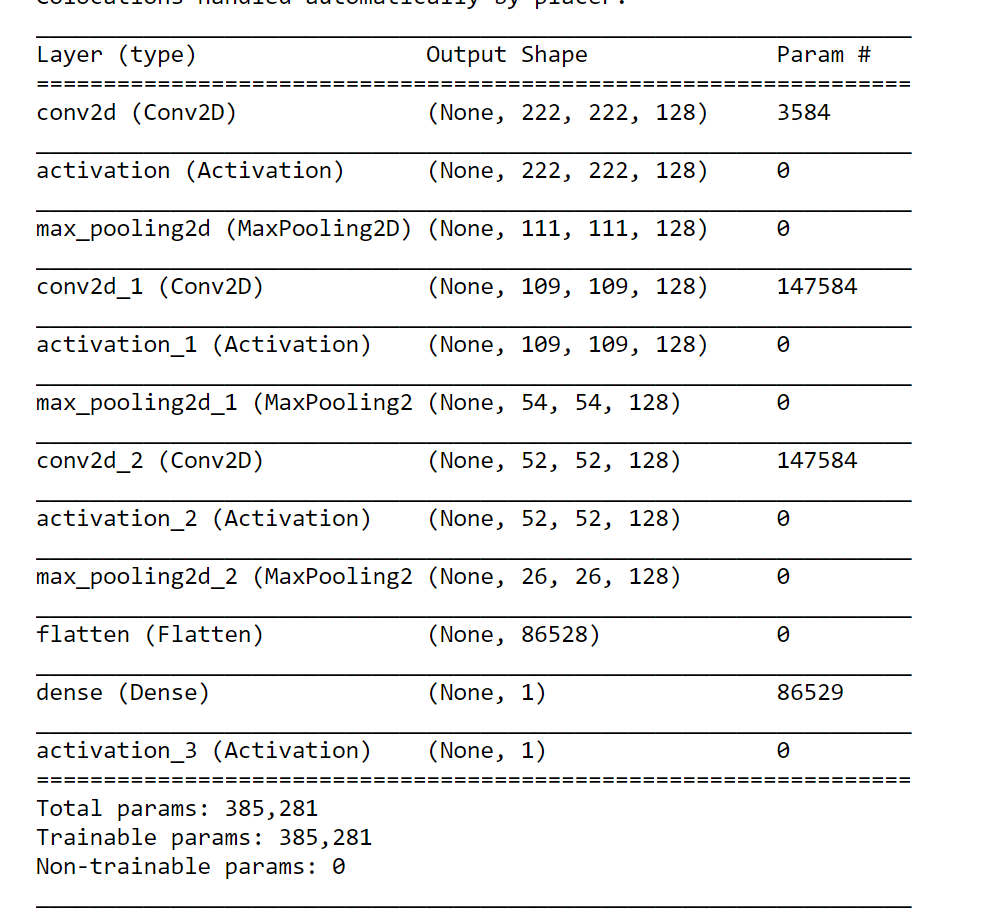

# Mole-Classification-Malignant-vs-Benign
## Current results:
84.4% validation accuracy

Learnings:
* The network tends to overfit after ~30 epochs with 128 layer size unless LR is changed on plateau
* ResNet50 seems like a good architecture to use on this type of data. Will try this next...

## Dataset:
https://www.kaggle.com/fanconic/skin-cancer-malignant-vs-benign/

Sample:

## Neural Net Architecture

