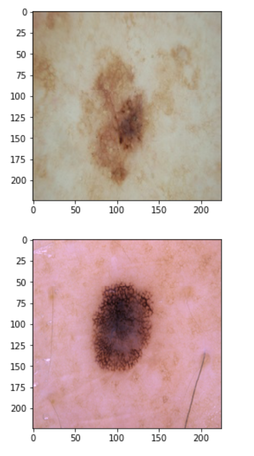

# Mole-Classification-Malignant-vs-Benign
## Current results:
84.4% validation accuracy

Learnings:
* LR scheduling needed to avoid over-fitting (usually happens around 30 epochs with current config)

## Dataset:
https://www.kaggle.com/fanconic/skin-cancer-malignant-vs-benign/

Sample:

## Neural Net Architecture

